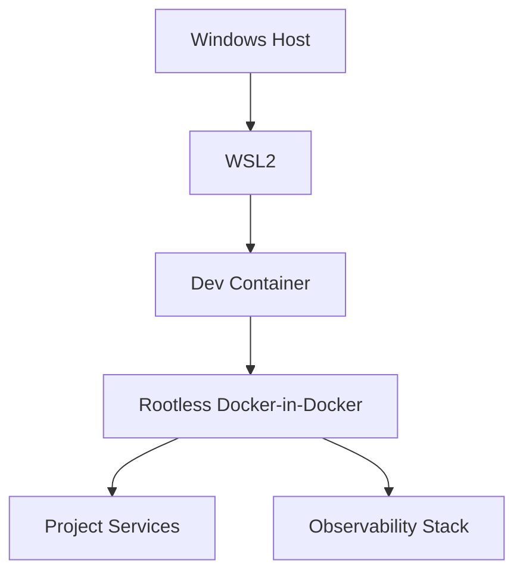
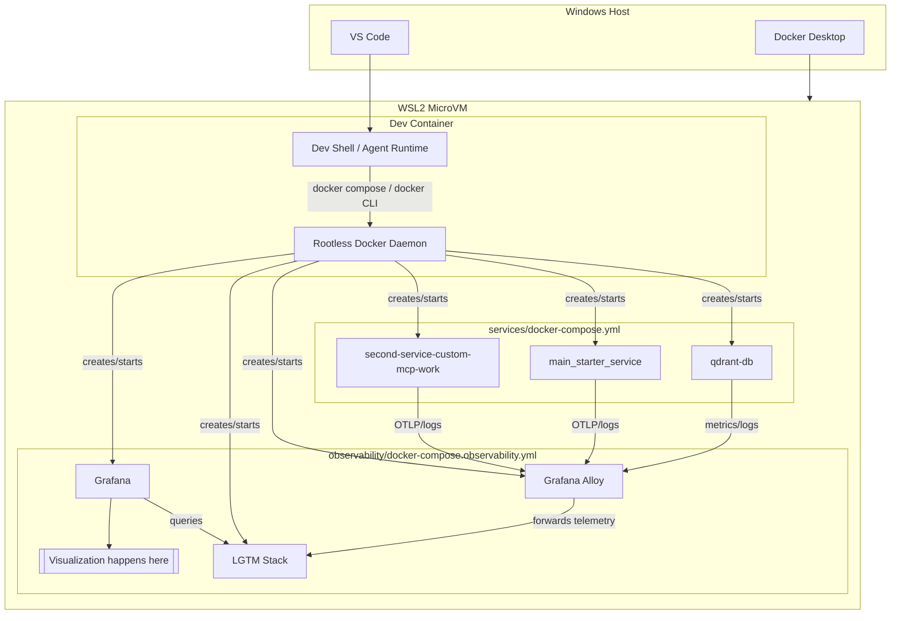

# dcker_mcp_setup

```text
dcker_mcp_setup/
├── .devcontainer/
│   └── requirements.txt
├── services/
│   ├── docker-compose.yml
│   ├── main_starter_service/
│   │   └── main_server.py
│   ├── qdrant/
│   │   └── qdrant_service.py
│   └── second-service-custom-mcp-work/
│       └── python_custom_server.py
├── observability/
│   ├── docker-compose.observability.yml
│   ├── OBSERVABILITY_GUIDE.md
│   ├── TELEMETRY_CONTRACTS.md
│   ├── LOG_SENSITIVITY_ASSESSMENT.md
│   ├── IMPLEMENTATION_REQUIREMENT_MAPPING.md
│   ├── alloy/
│   │   └── config/
│   ├── grafana/
│   │   └── provisioning/
│   └── runtime-logs/
├── startup-test/
│   ├── startup-and-test.sh
│   ├── startup-and-test-lite.sh
│   ├── cleanup.sh
│   └── README.md
├── tests/
│   ├── test_qdrant_service.py
│   └── observability/
│       ├── contracts/
│       └── flow/
├── MICROVM_DEVCONTAINER_STEPS.md
├── STARTUP_TEST.md
└── README.md
```

## Table of Contents

1. [Project Setup](#project-setup)
2. [Docker Setup](#docker-setup)
3. [Why This Exists](#why-this-exists)
4. [What's Included](#whats-included)
5. [Architecture](#architecture)
6. [LGTM in This Project](#lgtm-in-this-project)
7. [Security](#security)
8. [Quick Start](#quick-start)
9. [Who This Is For](#who-this-is-for)
10. [Status](#status)

## Project Setup

Local environment for developing and testing AI-agent workflows. It isolates development, services, and observability.

This setup uses rootless Docker - Docker runs without full system-level (admin/root) privileges. If a container is compromised, it has fewer permissions and is less likely to affect the host machine.

## Docker Setup

This project uses a rootless Docker-in-Docker setup inside the Dev Container.

- The Dev Container runs its own Docker daemon instead of mounting the host Docker socket. This means Docker commands inside the container talk to an internal daemon, not directly to your host machine's Docker engine. Relevant diagrams: [Docker-isolation-setup.png](Docker-isolation-setup.png), [architecture_srtict_isolation.png](architecture_srtict_isolation.png).
- Service containers run from the Dev Container through that inner daemon. In practice, a service started from the Dev Container, is launched by this container's own Docker runtime. Relevant diagrams: [project_setup.png](project_setup.png), [Docker-isolation-setup.png](Docker-isolation-setup.png).
- The Dev Container joins the shared `mcp-net` network for service communication. This gives the inner Docker-managed services a predictable network path for talking to each other. Relevant diagrams: [mcp-net.png](mcp-net.png), [project_setup.png](project_setup.png).
- The host Docker socket remains disabled by default for stricter isolation. The Dev Container does not have direct control over the host Docker daemon if something goes wrong. Relevant diagrams: [architecture_srtict_isolation.png](architecture_srtict_isolation.png), [Docker-isolation-setup.png](Docker-isolation-setup.png).


Different views:


At a high level, the model is:

- Windows host -> WSL2 -> Dev Container -> inner Docker daemon -> project services


Simple Docker view:




Detailed runtime view:



Connector legend: `creates/starts` means container lifecycle control by the inner Docker daemon. `OTLP/logs/metrics`, `forwards telemetry`, and `queries` are runtime data-flow links.

## Why This Exists

Separating services, tools, and telemetry run together to keep boundaries explicit:

- Development happens in a Dev Container inside WSL2
- Service containers run separately on controlled shared networks
- Observability runs as its own stack (Alloy + LGTM)
- Telemetry is contract-driven, not auto-scraped or privileged

## What's Included

- Local service stack with Qdrant and Python service placeholders
- Observability stack for logs, metrics, and traces
- Startup scripts enforcing deterministic bring-up order
- Contract and flow tests for services and telemetry wiring
- Documentation covering security, telemetry contracts, and runbooks

## Architecture

Services emit telemetry -> Alloy processes it -> LGTM stores and visualizes it.

## LGTM in This Project

LGTM is the observability backend bundle used by this repo:

- Loki: stores and indexes logs
- Grafana: visualization and dashboards
- Tempo: distributed traces backend
- Mimir: metrics backend

In this setup, Grafana Alloy collects and forwards telemetry into the LGTM backends, and Grafana queries those backends to render dashboards.

Where visualization happens:

- Visualization happens in Grafana (the UI/dashboard layer)
- In the diagram, this is the `Grafana -- queries --> LGTM` connection
- In the repo, the visualization configuration is under `observability/grafana/`

## Security

- No Docker socket exposure to Alloy
- Only explicit telemetry endpoints and mounts
- Sensitive log redaction before Loki ingestion
- Access-separated Grafana dashboards and log visibility

## Quick Start

1. Rebuild and reopen in the Dev Container (VS Code).
2. Use startup script in startup-test.
3. Validate service health, then observability health.
4. Confirm logs, metrics, and traces in Grafana.

## Who This Is For

- Developers exploring agent-service patterns
- Teams wanting safer setups (containerized) and observability
- Developers building/experimenting with a reproducible startup, testing, and telemetry behavior 

## Status

Sandbox with upgrade paths for stronger health checks, dashboards, and service-onboarding contracts.
