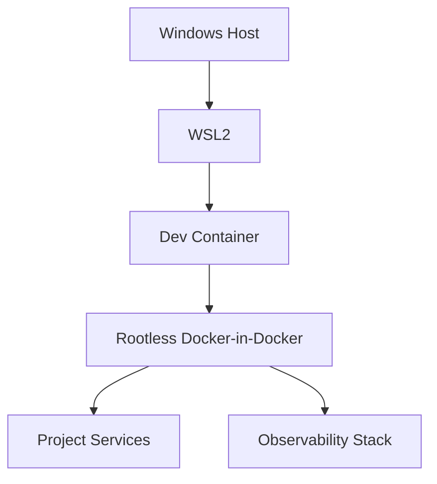
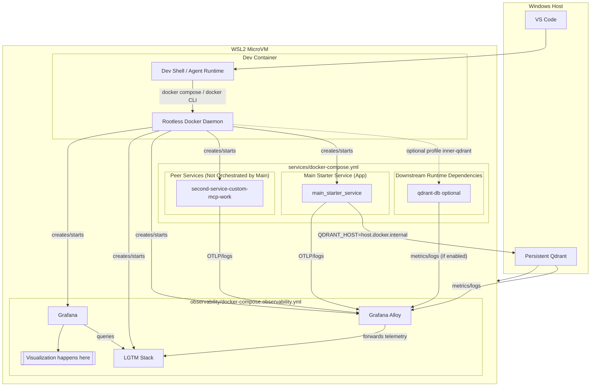
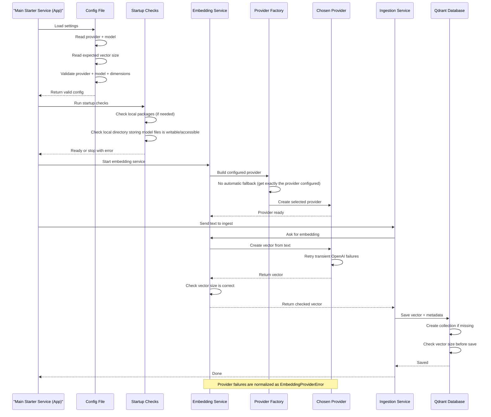

# dcker_mcp_setup

Project tree snapshot (source and docs only):

```text
dcker_mcp_setup/
├── .devcontainer/
│   └── requirements.txt
├── .vscode/
├── context_data/
├── observability/
│   ├── alloy/
│   │   ├── config/
│   │   └── env/
│   ├── grafana/
│   │   ├── dashboards/
│   │   ├── env/
│   │   ├── provisioning/
│   │   └── rbac/
│   ├── runtime-logs/
│   └── docker-compose.observability.yml
├── docs/
│   ├── architecture/
│   │   ├── architecture.png
│   │   ├── architecture_srtict_isolation.png
│   │   ├── Docker-isolation-setup.png
│   │   ├── mcp-net.png
│   │   └── project_setup.png
│   ├── history/
│   │   ├── implementation_requirement_mapping.md
│   │   └── secure_alloy_lgtm_observability_prompt.md
│   ├── observability/
│   │   ├── local_path_variables.md
│   │   ├── log_sensitivity_assessment.md
│   │   ├── observability_guide.md
│   │   └── telemetry_contracts.md
│   └── runbooks/
│       └── STARTUP_TEST.md
├── services/
│   ├── ai_pipeline/
│   │   ├── embedding/
│   │   │   ├── providers/
│   │   │   │   ├── base.py
│   │   │   │   ├── openai_provider.py
│   │   │   │   └── sentence_transformers_provider.py
│   │   │   └── service.py
│   │   └── ingestion/
│   │       └── service.py
│   ├── main_starter_service/
│   │   └── main_server.py
│   ├── qdrant/
│   │   ├── preUpsert_embeddingCreation_.md
│   │   └── qdrant_service.py
│   ├── second-service-custom-mcp-work/
│   │   └── python_custom_server.py
│   ├── config.py
│   └── docker-compose.yml
├── startup-test/
│   ├── cleanup.sh
│   ├── README.md
│   ├── startup-and-test-lite.sh
│   └── startup-and-test.sh
├── tests/
│   ├── observability/
│   │   ├── contracts/
│   │   └── flow/
│   ├── unit/
│   │   ├── conftest.py
│   │   ├── test_cache_path_config.py
│   │   ├── test_config.py
│   │   ├── test_dimension_validation.py
│   │   ├── test_embedding_service.py
│   │   └── test_provider_factory.py
│   ├── test_qdrant_service.py
│   └── test_qdrant_service.sh
├── microvm_devcontainer_steps.md
├── pytest.ini
└── README.md
```

## Table of Contents

1. [Project Setup](#project-setup)
2. [Docker Setup](#docker-setup)
3. [Why This Exists](#why-this-exists)
4. [What's Included](#whats-included)
5. [Architecture](#architecture)
6. [Embedding Roadmap (Phases)](#embedding-roadmap-phases)
7. [Phase 1 Sequence Diagram](#phase-1-sequence-diagram)
8. [LGTM in This Project](#lgtm-in-this-project)
9. [Security](#security)
10. [Quick Start](#quick-start)
11. [Shared Qdrant Mode](#shared-qdrant-mode)
12. [Upsert Observability](#upsert-observability)
13. [Observability Issues and Fixes](#observability-issues-and-fixes)
14. [Who This Is For](#who-this-is-for)
15. [Status](#status)

## Project Setup

This is a local environment for AI-agent development and testing.
It keeps development, services, and observability isolated.

It uses rootless Docker.
That means Docker runs without full admin/root privileges.
If a container is compromised, host impact is reduced.

## Docker Setup

This project uses rootless Docker-in-Docker inside the Dev Container.

- The Dev Container runs its own Docker daemon.
- The host Docker socket is not mounted.
- Docker commands inside the container talk to the inner daemon, not the host engine.
- Service containers started from the Dev Container are launched by that inner runtime.
- The Dev Container joins the shared `mcp-net` network for service-to-service traffic.
- The host Docker daemon stays isolated from the Dev Container.

Diagrams:

- [docs/architecture/Docker-isolation-setup.png](docs/architecture/Docker-isolation-setup.png)
- [docs/architecture/architecture_srtict_isolation.png](docs/architecture/architecture_srtict_isolation.png)
- [docs/architecture/project_setup.png](docs/architecture/project_setup.png)
- [docs/architecture/mcp-net.png](docs/architecture/mcp-net.png)


Different views:


High-level model:

- Windows host -> WSL2 -> Dev Container -> inner Docker daemon -> project services


Simple Docker view:


```mermaid
graph TD
	Host[Windows Host] --> WSL[WSL2]
	WSL --> Dev[Dev Container]
	Dev --> DinD[Rootless Docker-in-Docker]
	DinD --> Services[Project Services]
	DinD --> Obs[Observability Stack]
```


Detailed runtime view:


```mermaid
graph TD
	subgraph Host[Windows Host]
		VSCode[VS Code]
		HostQdrant[Persistent Qdrant]
	end

	subgraph WSL2[WSL2 MicroVM]
		subgraph DevContainer[Dev Container]
			Shell[Dev Shell / Agent Runtime]
			InnerDocker[Rootless Docker Daemon]
		end

		subgraph Services[services/docker-compose.yml]
			subgraph Orchestrator["Main Starter Service (App)"]
				Main[main_starter_service]
			end
			subgraph Dependencies["Downstream Runtime Dependencies"]
				Qdrant[qdrant-db optional]
			end
			subgraph PeerServices["Peer Services (Not Orchestrated by Main)"]
				Second[second-service-custom-mcp-work]
			end
		end

		subgraph Observability[observability/docker-compose.observability.yml]
			Alloy[Grafana Alloy]
			LGTM[LGTM Stack]
			Grafana[Grafana]
			VizMarker[[Visualization happens here]]
		end
	end

	VSCode --> Shell
	HostQdrant --> WSL2
	Shell -- docker compose / docker CLI --> InnerDocker
	InnerDocker -. optional profile inner-qdrant .-> Qdrant
	InnerDocker -- creates/starts --> Main
	InnerDocker -- creates/starts --> Second
	InnerDocker -- creates/starts --> Alloy
	InnerDocker -- creates/starts --> LGTM
	InnerDocker -- creates/starts --> Grafana
	Main -- QDRANT_HOST=host.docker.internal --> HostQdrant
	Main -- OTLP/logs --> Alloy
	Second -- OTLP/logs --> Alloy
	HostQdrant -- metrics/logs --> Alloy
	Qdrant -- metrics/logs (if enabled) --> Alloy
	Alloy -- forwards telemetry --> LGTM
	Grafana -- queries --> LGTM
	Grafana --> VizMarker
```

Connector legend:

- `creates/starts` means lifecycle control by the inner Docker daemon.
- `OTLP/logs/metrics`, `forwards telemetry`, and `queries` are runtime data-flow links.

## Why This Exists

The goal is clear boundaries between app runtime and observability.

In this setup:

- Development happens in a Dev Container inside WSL2
- Service containers run separately on controlled shared networks
- Observability runs as its own stack (Alloy + LGTM)
- Telemetry is contract-driven, not auto-scraped or privileged

## What's Included

- Local service stack with Qdrant and Python service placeholders
- Observability stack for logs, metrics, and traces
- Startup scripts enforcing deterministic bring-up order
- Contract and flow tests for services and telemetry wiring
- Documentation covering security, telemetry contracts, and runbooks

## Architecture

Services emit telemetry -> Alloy processes it -> LGTM stores and visualizes it.

- Qdrant is the vector database for semantic search and embedding storage.
- The stack is modular, so services can be swapped with low disruption.
- Observability uses Grafana, Alloy, and LGTM for logs, metrics, and traces.
- Services are small and focused, then composed into larger workflows.

## Embedding Roadmap (Phases)

Source: services/qdrant/preUpsert_embeddingCreation_.md

1. Phase 1 - Embedding foundation and configuration
- Status: implemented
- Provider abstraction, config validation, startup checks, normalized errors, and Qdrant safety checks.

2. Phase 2 - Document processing pipeline
- Status: planned
- Add readers (txt, md, pdf, eml, mbox), chunking, and metadata schema.

3. Phase 3 - Qdrant integration and persistence
- Status: partially implemented
- Expand collection lifecycle, persistence, host Qdrant load/rebuild flow, and integration tests.

4. Phase 4 - CLI-based ingestion
- Status: planned
- Add CLI args, validation, and progress output for the load/rebuild flow.

5. Phase 5 - Search API
- Status: planned
- Add /search, metadata filtering, and health endpoints.

6. Phase 6 - Frontend UI
- Status: planned
- Add upload flow, collection views, and semantic search UI.

7. Phase 7 - Gmail integration
- Status: planned
- Add OAuth ingestion, filters, metadata preservation, and incremental sync.

8. Phase 8 - Production readiness
- Status: planned
- Add KPI metrics, async ingestion, embedding cache, security, and backup/restore.

## Phase 1 Sequence Diagram

This shows the Phase 1 path from text to stored embedding.


```mermaid
sequenceDiagram
	participant App as "Main Starter Service (App)"
	participant Config as Config File
	participant Health as Startup Checks
	participant Embed as Embedding Service
	participant Factory as Provider Factory
	participant Provider as Chosen Provider
	participant Ingest as Ingestion Service
	participant DB as Qdrant Database

	App->>Config: Load settings
	Config->>Config: Read provider + model
	Config->>Config: Read expected vector size
	Config->>Config: Validate provider + model + dimensions
	Config-->>App: Return valid config

	App->>Health: Run startup checks
	Health->>Health: Check local packages (if needed)
	Health->>Health: Check local directory storing model files is writable/accessible
	Health-->>App: Ready or stop with error

	App->>Embed: Start embedding service
	Embed->>Factory: Build configured provider
	Factory->>Factory: No automatic fallback (get exactly the provider configured)
	Factory->>Provider: Create selected provider
	Provider-->>Embed: Provider ready

	App->>Ingest: Send text to ingest
	Ingest->>Embed: Ask for embedding
	Embed->>Provider: Create vector from text
	Provider->>Provider: Retry transient OpenAI failures
	Provider-->>Embed: Return vector
	Embed->>Embed: Check vector size is correct
	Embed-->>Ingest: Return checked vector

	Ingest->>DB: Save vector + metadata
	DB->>DB: Create collection if missing
	DB->>DB: Check vector size before save
	DB-->>Ingest: Saved
	Ingest-->>App: Done

	Note over Provider,Embed: Provider failures are normalized as EmbeddingProviderError
```

1. The app reads settings (provider, model, and dimensions).
2. The app runs startup checks so problems are caught early.
3. The provider factory builds only the configured provider (no fallback).
4. The text is turned into a vector.
5. Transient OpenAI errors are retried.
6. The vector size is checked to avoid bad data.
7. The vector is saved in Qdrant.

If anything fails, the process stops with a clear error.

## LGTM in This Project

LGTM is the observability backend bundle used by this repo.

- Loki: stores and indexes logs
- Grafana: visualization and dashboards
- Tempo: distributed traces backend
- Mimir: metrics backend

In this setup, Alloy collects and forwards telemetry to LGTM.
Grafana queries LGTM to render dashboards.

Where visualization happens:

- Visualization happens in Grafana.
- In the diagram, this is `Grafana -- queries --> LGTM`.
- In the repo, related config is under `observability/grafana/`.

## Security

- No Docker socket exposure to Alloy
- Only explicit telemetry endpoints and mounts
- Sensitive log redaction before Loki ingestion
- Access-separated Grafana dashboards and log visibility

## Quick Start

1. Rebuild and reopen in the Dev Container (VS Code).
2. Run the startup script in startup-test.
3. Validate service health, then observability health.
4. Confirm logs, metrics, and traces in Grafana.

## Shared Qdrant Mode

Default behavior uses a host-level persistent Qdrant endpoint so both local runs and Dev Container runs can query the same vector store.

- App services now resolve Qdrant via `QDRANT_HOST` and default to `host.docker.internal`.
- Start host-level Qdrant once (outside inner DinD).
- Keep it running for shared persistence.
- Optional inner Qdrant remains available behind compose profile `inner-qdrant`.
- Host Qdrant metrics and logs are collected through Alloy when `QDRANT_HOST_LOGS_DIR` is mounted.

Examples:

```bash
# Use host-level Qdrant (default path)
docker compose -f services/docker-compose.yml up -d main_starter_service second-service-custom-mcp-work

# Optional inner Qdrant (only when explicitly needed)
docker compose -f services/docker-compose.yml --profile inner-qdrant up -d qdrant-db
```

## Who This Is For

- Developers exploring agent-service patterns
- Teams wanting safer setups (containerized) and observability
- Developers building/experimenting with a reproducible startup, testing, and telemetry behavior 

## Upsert Observability

Qdrant upsert operations are observable end-to-end through the existing LGTM stack. No additional infrastructure is needed.

### How it works

Every call to `QdrantHelper.upsert()` in `services/qdrant/qdrant_service.py` writes a structured JSON log event.
This happens right after the Qdrant call succeeds or fails.

```json
{
  "message": "qdrant_upsert_event",
  "upsert_status": "success",
  "upsert_latency_ms": 12.5,
  "collection": "embeddings",
  "point_id": "1",
  "vector_dim": 384
}
```

Alloy tails `observability/runtime-logs/main_starter_service/app.log`.
It parses the `service` field as a Loki label.
Then it pushes logs to Loki.
Grafana queries Loki for dashboard panels.

### Grafana dashboard

Open: **http://localhost:3000/d/qdrant-upsert-observability**.

Credentials:

- Use `GRAFANA_ADMIN_USER` and `GRAFANA_ADMIN_PASSWORD` from your startup environment.
- If you use `startup-test/startup-and-test.sh` without overrides, defaults are `change_me` / `change_me_strong`.

| Panel | What it shows |
|---|---|
| Upserts (success, selected range) | Total successful upserts in the selected time window |
| Upserts / minute | Throughput time series |
| Upsert errors / minute | Error rate time series |
| Upsert latency p95 (ms) | 95th-percentile latency derived from `upsert_latency_ms` |
| Upsert latency avg (ms) | Average latency |
| Recent upsert events | Raw log panel — live structured events |

Set the dashboard time range to **Last 15 minutes** to see recent events.

### Alloy config (`observability/alloy/config/runtime.river`)

The config is a single flat River file.
It does not use `import.file` modules.
Key sections:

- `otelcol.receiver.otlp` — receives OTLP traces from services on port 4317
- `loki.source.file` + `loki.process` — tails service log files, parses JSON, promotes `service` and `level` as Loki labels, pushes to Loki
- `prometheus.scrape` + `prometheus.remote_write` — scrapes Qdrant metrics from `host.docker.internal:6333`

---

## Status

Sandbox with upgrade paths for stronger health checks, dashboards, and service-onboarding contracts.

