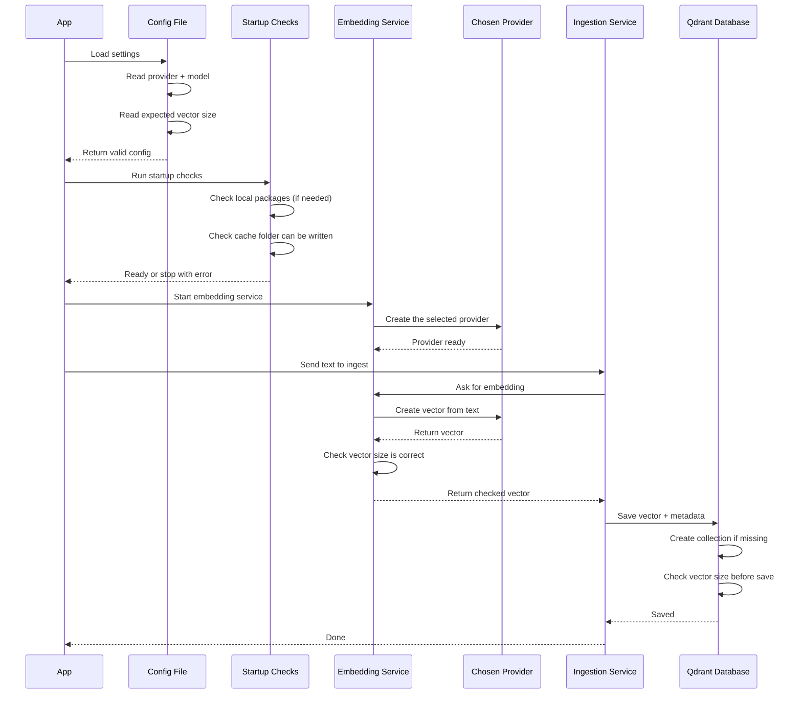

# Phase 1 Flow (Simple Version)

This shows what happens from start to finish when text is converted into an embedding and saved.

## In Plain Words

1. The app reads settings (which provider to use and model details).
2. The app runs startup checks so problems are caught early.
3. One embedding provider is created from the settings.
4. The text is turned into a vector.
5. The vector size is checked to avoid bad data.
6. The vector is saved in Qdrant.

If anything fails, the process stops with a clear error instead of silently continuing.
